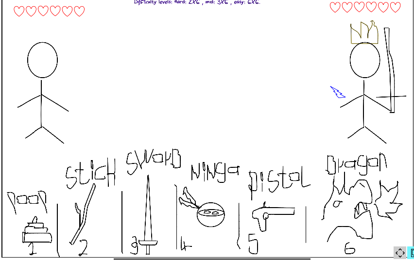

#  
 The crooked sword 
 
## Story:
Once upon a time,  there was a village called 'the village',living in peace,until it was attacked by mesterious creatures, 'they can only be defeated by the crooked sword' said the village wizard to the village hero, 'it was made by titans and it was given to the 'lighting god' ' said the wizard, so the hero travelled to the land of gods, searching for the sword , till finally he found it, the hero told the 'lightning god' that he needs the sword, 'Battle me my son, if you beat me, then you are worthy of having it.' said the 'Lighting god'.   
## How to play: 
In each round use dice twice, The first throw is yours, and the second throw belongs to the 'Lightning god'. In each throw ,use the number to select the according numbered item, so in each round you and the 'lightning god' will have his own item, and according to the strength of the items, one of you two will win the round and the other will lose only one of his remaining lives.  
## Extra Rules: 
1. If you managed to win 3 successive rounds ,You get an extra life if your intial life were reduced (e.g. if you were playing hard mode , and you managed to win 3 rounds in a row, and your life counter was 2 out of 3 , you get an extra life ,but if your life counter was 3/3 , you get nothing :) )
2. the item numbered '6' ('Dragon') reduces the opponent life by 2 lives, and can't be used in 2 successive rounds per player.(e.g. if you [or the 'lighning god '] got a 6 in a round,  the other side losses 2 lives, and in the next round if you were lucky enough to get another 6 , you can't get the 'Dragon' but you get 'poop' instead :( ) 
3. If you managed to hit the same number in 2 successive rounds , you get the 'silver' shield which can protect you from all other attacks, Except for the 'dragon' attack, it reduces the damage recieved from the 'Dragon' to 1 insted of 2.
4. If you managed to hit the same number in 3 successive rounds , you get the 'diamond' shield which can protect you from all other attacks, including  the 'dragon' attack.
5. silver shields last for only one round, diamond shields last for 2 successive rounds.
6. in solo mode, dimonds shields are only allowe to the player (i.e rule no. 3 is for both the player and the 'lightning god', but rule no. 4 is only for the player ;) ) 
7. Have Fun.

## Multiplayer mode
- each player rolls the dice once and the the player with higher number plays as the 'Lightning god'

## Goal:  
- Beat the 'Lightning god' to get the legendary 'Crooked Sword'.

##  Difficulty levels (solo mode):  
- Hard : 2 lives 'you'  Vs  6 lives 'lightning god'  
- Mid : 3 lives 'you'  Vs  6 lives 'lightning god'.
- Easy : 6 lives  Vs  6 lives

